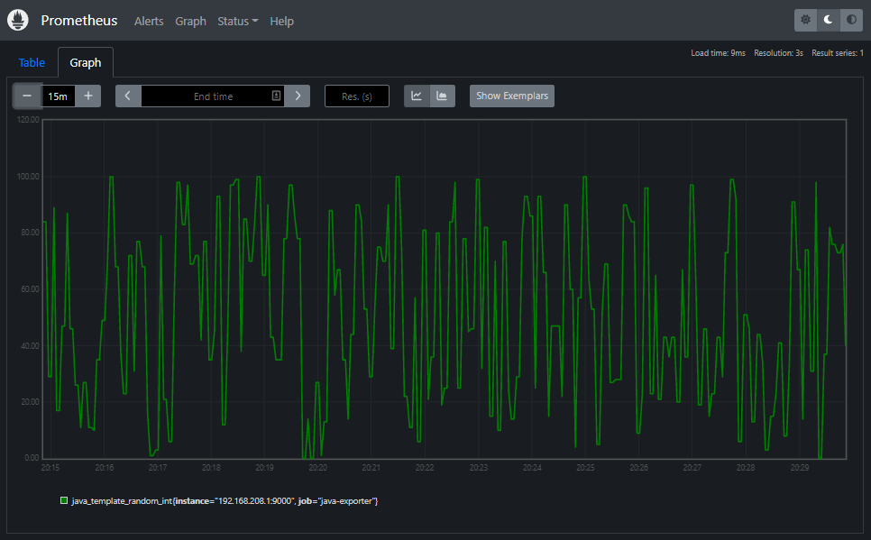

# Java Exporter Template

A basic gradle project for a java metrics exporter development that can be used for prometheus.

This is a fork form Java API Server template and refactored to become a metrics exporter. 

Use your existing java knowledge in writing metrics exporter.

## Pre-requisite

* Java 17

## Cloning

1. **Create a fork** of this repository.

2. **Clone the forked repository** to your machine.

3. **Test your cloned repository** using the following command:

   ```
   gradlew test
   ```

   > If it completes successfully your setup is good.

## Packages

### commons

Contains all the common codes that can usually cross to any available packages.

### config

Must have the logic that involves configurations. 

Aside from the **AppConfig class** *(i.e. more about this in **the application.properties file section**.)*, it also contains the **MetricsModule class**. This class is where we should normally wires the services and respositories implementations. 

The wiring is done through a **guice framework**.

### controller

The classes here must be responsible for handling the **resource endpoints**. 

In this template, you will find all the metrics retrieval resource implementation.

### model

Must hold the **persistence model** of the application. 

In this template, a model of a metrics is being used. To avoid the boilerplate of implementing all the setter and getter methods, **lombok** is being used for this.

### service

The classes here must hold the **business logic** 

This template contains a simple metrics service implementation and utilizes **freemarker templating framework**.

### wrapper

The classes here **wraps all the third-party classes**. So that, the other application classes knows only the wrappers and not the third-party classes. This is for **managing the third-party classes in one place**. This is beneficial if a third-party class has deprecated a method and recommends to use a replacement method. With wrapper, you only need to update the wrapper class and not all the invocations that spreads to different classes.

## Application class

The **Application class** is the bootstrap of the server. By default, the server is listening on port **9000**. You can change this by updating it in the **application.properties** file. If you are planning to run the server using IDE. This is the class to be ran.

If you've packaged it and wants to run the server, execute the following batch file:

```
<APPLICATION_ROOT>\java-exporter.bat
```

> The <APPLICATION_ROOT> is the location where you've extracted the package. *See the [build document](BUILD.md) on how to package the project.*

If you ran the server, expect to see the following output:

```
The app started on port 9000
Press any key to stop...
```

To test it, while the server is running, **open a browser** and use the following address:

http://localhost:9000/metrics

Expect to see the following output:

```json
#Coming from a java-exporter default template.
java_template_random_int 88
```

If you want to **stop the server**, just **press any key**.

## The application.properties file

The **application.properties file** holds the configurations specific to the application such as the following:

* server.port
* base.url

The application.properties file is located in the following directory:

```
<PROJECT_DIR>\conf
```

> The <PROJECT_DIR> is the location where you've cloned the repository.

The **class that reads this file** is the following:

```
AppConfig
```

If want to add more/update configuration settings you can **update this properties file** and don't forget to also update the class that reads it. 

In the **actual package**, you can find this file in the following directory:

```
<APPLICATION_ROOT>\conf
```

> The <APPLICATION_ROOT> is the location where you've extracted the package. *See the [build document](BUILD.md) on how to package the project.*

## The log4j2.xml file

The **log4j2.xml file** holds the logging configuration and it is located in the following location:

```
<PROJECT_DIR>\src\main\resources
```

> The <PROJECT_DIR> is the location where you've cloned the repository.

In the **actual package**, you can find this file in the following directory:

```
<APPLICATION_ROOT>\conf
```

> The <APPLICATION_ROOT> is the location where you've extracted the package. *See the [build document](BUILD.md) on how to package the project.*

## Swagger Definition

Load the following swagger definition to https://editor.swagger.io/:

```
<PROJECT_DIR>\swagger\metrics-api.yaml
```

> The <PROJECT_DIR> is the location where you've cloned the repository.

Doing this will show the available metrics resource endpoints.

## Testing the Endpoints by Browser

### Requesting the Metrics

**Request Data**

| Field  | Value                         |
| ------ | ----------------------------- |
| Method | GET                           |
| URL    | http://localhost:9000/metrics |

*See the details of the URL pattern from the swagger definition.*

**Response Data**

| Field  | Value                                                        |
| ------ | ------------------------------------------------------------ |
| Status | 200                                                          |
| Header | Content-Type: text/plain                                     |
| Body   | #Coming from a java-exporter default template.<br/>java_template_random_int 88 |

## Testing with Prometheus

### Assumptions

* **Prometheus server** in **localhost**.
* **java_exporter** in **192.168.208.1**.

### Updating the configuration

In **Prometheus server**

1. **Edit** the **prometheus.yml file** with a text editor.

2. In the **scrape_configs section** add the following:

   ```yaml
     - job_name: "java-exporter"
       scrape_interval: 5s
       static_configs:
         - targets: ["192.168.208.1:9000"]
   ```

3. **Save** the **file**.

4. **Restart** the **prometheus service**.

### Displaying the java-exporter Metrics

1. **Open a browser** and **access the prometheus server** using the following address:

   http://localhost:9090/

2. **Click** the **Status ** from the toolbar and **select Targets**.

   Expect one of the targets is **java-exporter** and it is **up**. 

   > This is just to confirm that prometheus can reach the java-exporter.

3. **Click** the **Graph** from the toolbar.

4. **Type** the following in the **search bar**:

   ```
   java_template_random_int
   ```

5. **Click** the **Execute button**.

   Expect to see the following:

   ```
   java_template_random_int{instance="192.168.208.1:9000", job="java-exporter"}
   ```

6. **Click** the **Graph tab**.

   Expect to see the following metrics coming from java-exporter.

   

## License

This project is licensed under the MIT License - see the [LICENSE.md](LICENSE.md) file for details

## [Build](BUILD.md)

## [Changelog](CHANGELOG.md)

## Author

* Ronaldo Webb
